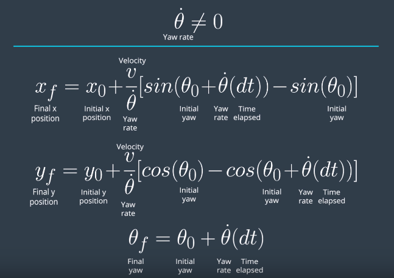

This repository contains the implementation of a particle filter which solves the localization problem of the Kidnapped Vehicle project of Udacity's Self-Driving Car Nanodegree.

# Project Introduction
Your robot has been kidnapped and transported to a new location! Luckily it has a map of this location, a (noisy) GPS estimate of its initial location, and lots of (noisy) sensor and control data.

In this project you will implement a 2 dimensional particle filter in C++. Your particle filter will be given a map and some initial localization information (analogous to what a GPS would provide). At each time step your filter will also get observation and control data.

# Particle filter

## Initialization
The first thing that needs to be done is initialize the particle filter with the number of particles that we want to use and the respective particles. I used 100 particles as this number provided a good solution without too much processing load. Each particle was initialized at the sensed GPS position and heading with Gaussian noise added to each of these variables.

## Prediction
In this step, the position of all particles are updated according to the motion model (bicycle model) and the control measurements (velocity and yaw rate) for the elapsed time since the last update. This is also a probabilistic process since the control measurements can have noise. According to this model, the new positions are updated as follows:

Update equations when the yaw rate is 0. Taken from the Udacity lessons.

Update equations when the yaw rate is not 0. Taken from the Udacity lessons.

If we considered that the control measurements were noisy, then we'd add Gaussian noise to the velocity and yaw rate before computing the new positions. However, contrary to what is explained in the lessons, the provided standard deviations for the prediction step are actually for the GPS measurements, which are unfit to use with the control variables. As such, instead of adding noise to the control measurements I added noise to the predicted localization (similar to what is done in the initialization step).

## Update
In the update step, in short, we need to compute the weights for each particle given new sensor measurements. For each particle, we need to transform the LIDAR observations from the particle's coordinates to map coordinates. Afterwards, for each transformed observation of each particle, we need to associate it to the nearest map landmark (computing Nearest Neighbor). Each of these associations (transformed observation to map landmarks) will be part of the final weight of the corresponding particle, by computing how probable it is that the transformed observation corresponds to its associated landmark according to a normal multivariate distribution, using sensor standard deviations. The final weight of the particle will be the product of each of the individual observation weights.

Each of the transformed observations coordinates and associations for each particle are saved so they can be sent back to the simulator for visualization purposes.

## Resampling
The final step of the particle filter pipeline is resampling, where the particles are resampled according to their weights. In this project, I used a discrete distribution.

# Results
The implemented particle filter successfully estimates the robot's location. A recording of a simulator run can be seen in [this video](report/particle_filter_project.mp4).

# Running the code
Some scripts have been included to streamline the process of building and running the particle filter, these can be leveraged by executing the following in the top directory of the project:

1. ./clean.sh
2. ./build.sh
3. ./run.sh
